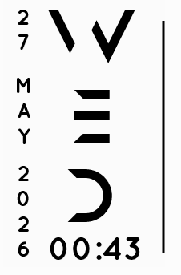

# Axis


Wallpaper: [Evelyn #1](https://steamcommunity.com/sharedfiles/filedetails/?id=3676910198)

## Features

- Vertical minimal layout
- Dynamic clock
- Futuristic typography
- Lightweight setup

## Preview

Minimal vertical Rainmeter skin inspired by Mond aesthetic.




## Installation

1. Install Rainmeter
2. Move `Axis` into:

```text
Documents\Rainmeter\Skins
```

## Required Fonts

This skin uses the following fonts for the intended aesthetic and layout:

- Anurati
- Quicksand

All required font files are included in:

```text
Skins\@Resources\Fonts
```

Install all fonts before loading the skin to ensure proper rendering.

## Credits

- Created by **Goa**